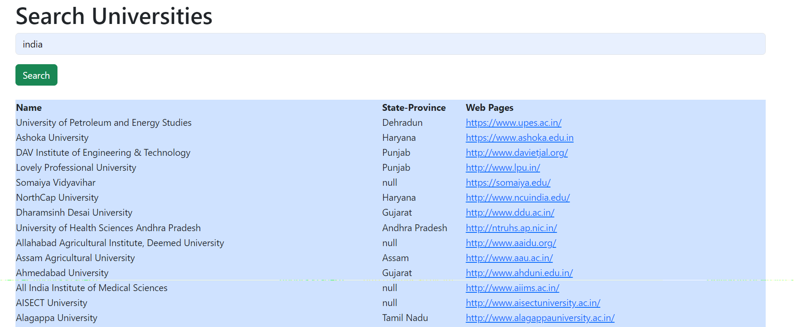

# University Data

To run the Project locally, follow these steps:

1. Clone the repository: `git clone https://github.com/Yawer091/University.git`
2. Install dependencies: `npm install`
3. Set up the database and configure environment variables.
4. Start the development frontend-app: `npm start / GoLive / open with live server`
5. Start the server: `npm run server`

FRONTEND

Routes:

/getuniversity --To get all university

/favouriteuniversity--to add to favourite
